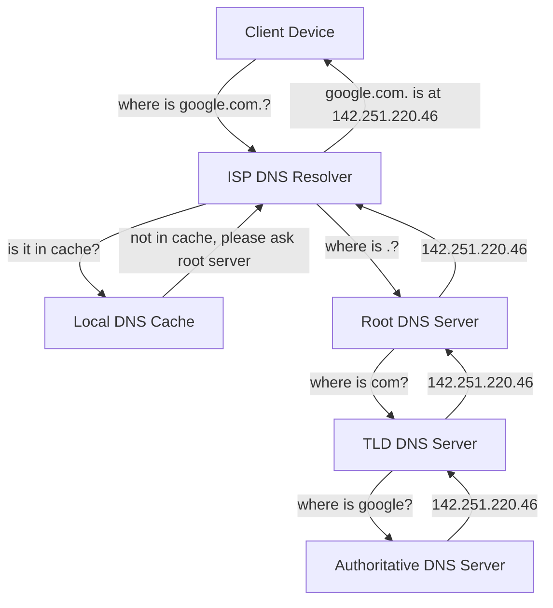
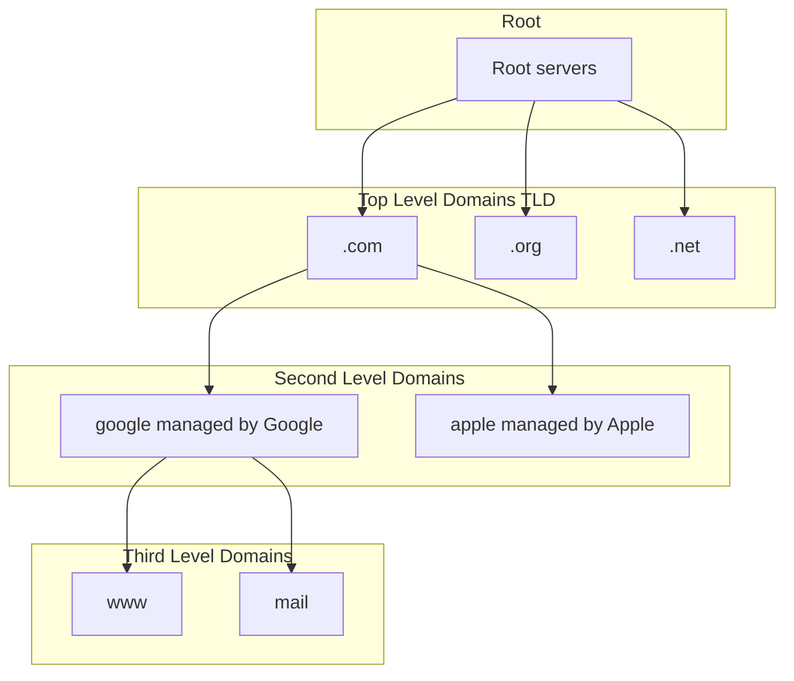

The original image is [How does DNS work?](/images/IOyLj4i.jpg)
taken from the slides
[DNS security presentation](http://www.slideshare.net/srikrupa5/dns-security-presentation-issa).
Also see
[DNS resolution explained](https://dev.to/blake/dns-explained-resolution-a2i)
for a more detailed explanation.

<figure style="border: 1px dotted gray;">

  <figcaption style="text-align: center; border: 1px dotted blue;">How does DNS work?</figcaption>
</figure>

A Domain Name System (DNS) translates a domain name such as www.example.com to an IP address.

DNS is hierarchical, with a few authoritative servers at the top level. Your router or ISP provides information about which DNS server(s) to contact when doing a lookup. Lower level DNS servers cache mappings, which could become stale due to DNS propagation delays. DNS results can also be cached by your browser or OS for a certain period of time, determined by the [time to live (TTL)](https://en.wikipedia.org/wiki/Time_to_live).

<figure style="border: 1px dotted gray;">

  <figcaption style="text-align: center; border: 1px dotted blue;">DNS Hierarchy</figcaption>
</figure>

- **NS record (name server)** - Specifies the DNS servers for your domain/subdomain.
- **MX record (mail exchange)** - Specifies the mail servers for accepting messages.
- **A record (address)** - Points a name to an IP address.
- **CNAME (canonical)** - Points a name to another name or `CNAME` (example.com to www.example.com) or to an `A` record.

Services such as [CloudFlare](https://www.cloudflare.com/dns/) and [Route 53](https://aws.amazon.com/route53/) provide managed DNS services. Some DNS services can route traffic through various methods:

- [Weighted round robin](https://www.jscape.com/blog/load-balancing-algorithms)
  - Prevent traffic from going to servers under maintenance
  - Balance between varying cluster sizes
  - A/B testing
- [Latency-based](https://docs.aws.amazon.com/Route53/latest/DeveloperGuide/routing-policy.html#routing-policy-latency)
- [Geolocation-based](https://docs.aws.amazon.com/Route53/latest/DeveloperGuide/routing-policy.html#routing-policy-geo)

## Disadvantage(s): DNS

- Accessing a DNS server introduces a slight delay, although mitigated by caching described above.
- DNS server management could be complex and is generally managed by [governments, ISPs, and large companies](http://superuser.com/questions/472695/who-controls-the-dns-servers/472729).
- DNS services have recently come under [DDoS attack](http://dyn.com/blog/dyn-analysis-summary-of-friday-october-21-attack/), preventing users from accessing websites such as Twitter without knowing Twitter's IP address(es).

## Source(s) and further reading

- [DNS architecture](<https://technet.microsoft.com/en-us/library/dd197427(v=ws.10).aspx>)
- [Wikipedia](https://en.wikipedia.org/wiki/Domain_Name_System)
- [DNS articles](https://support.dnsimple.com/categories/dns/)
- [DNS resolution explained](https://dev.to/blake/dns-explained-resolution-a2i)
